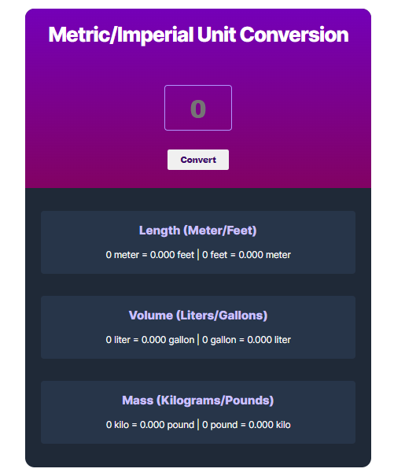

# Unit Converter
Scrimba - Frontend Developer Career Path - Unit Converter - Solo Project
Scrimba is the next-generation platform for learning how to code. Scrimba screencasts enables to interact with the code directly in the player. This way, you'll have more fun and learn faster. The courses subjects like HTML, CSS, JavaScript, React and more.

To do this project you need a basic understanding of HTML, CSS, Javascript and principles of responsive web design.

# Buid With
- HTML
- CSS
- Javasript
- Visual studio code
- Responsive Web Design

## Overview

### screenshot

## Links
- [Solution](https://github.com/Dachi-Papashvili88/unit-converter)
- [Live](https://dachi-papashvili88.github.io/unit-converter/)

